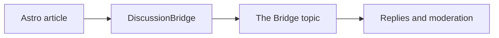

## Structure readers can navigate

This article proves that semantic Markdown remains useful on both sides of the
Bridge. Its headings build Astro's **On this page** navigation while the same
structure travels to the companion topic.

| Capability | Source | Expected destination |
| --- | --- | --- |
| Navigation | Markdown headings | Native page and topic structure |
| Diagram | Mermaid source | Rendered SVG |
| Mathematics | TeX notation | Typeset expression |
| Media | Local SVG | Safe responsive image |

## A portable diagram



The diagram source is ordinary text in the document, so it remains portable
even when a renderer changes.

## Mathematics without screenshots

Inline notation such as $E = mc^2$ remains selectable text. A display equation
can communicate the stable one-source-to-one-topic relationship:

$$
\operatorname{bridge}(s) = t \quad\text{and}\quad \operatorname{bridge}(s) \neq t_2
$$

## Media with an explicit origin


The image is a first-party demo asset. It does not depend on an opaque external
image host, and its alternative text remains part of the content.

## Code and links remain ordinary content

```json
{
  "source": "astro",
  "discussion": "one durable Bridge Record",
  "fallback": false
}
```

Return to the [DiscussionBridge demo hub](https://demo.discussionbridge.dev/)
or continue below in the live companion discussion.
